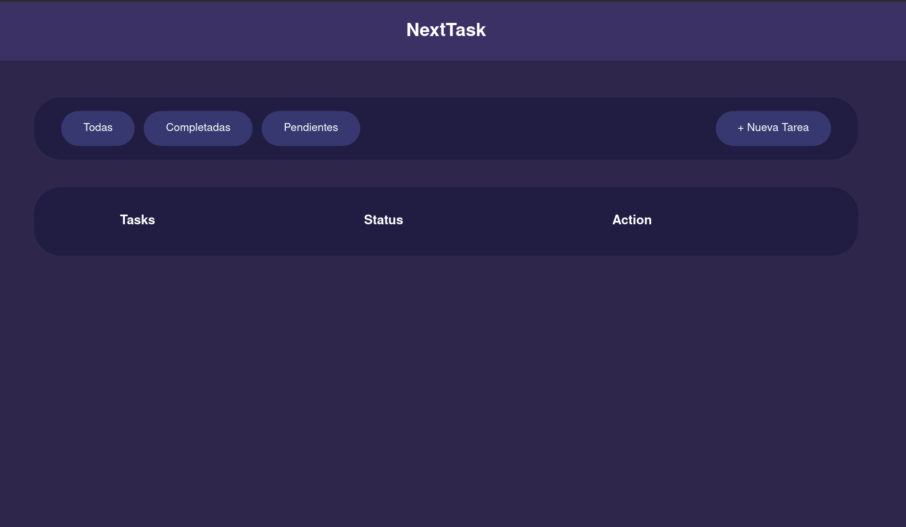
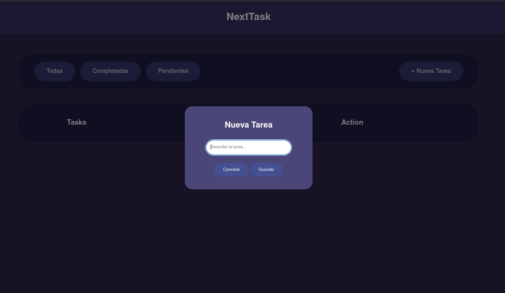
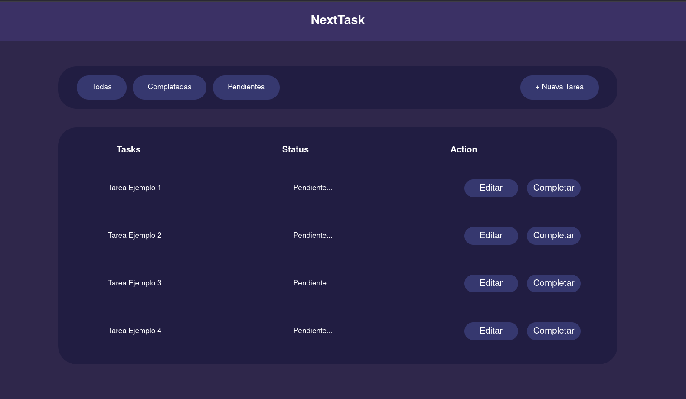
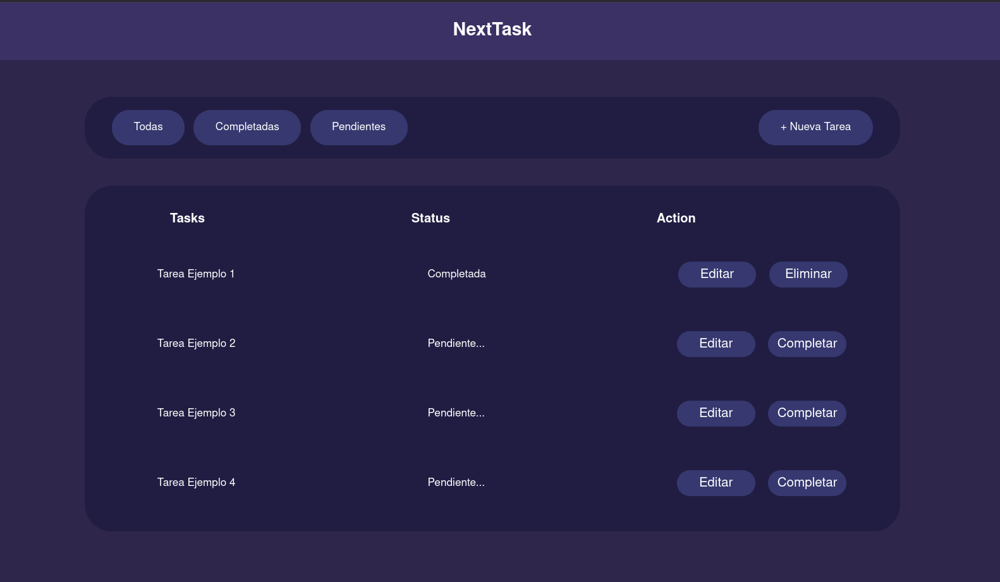
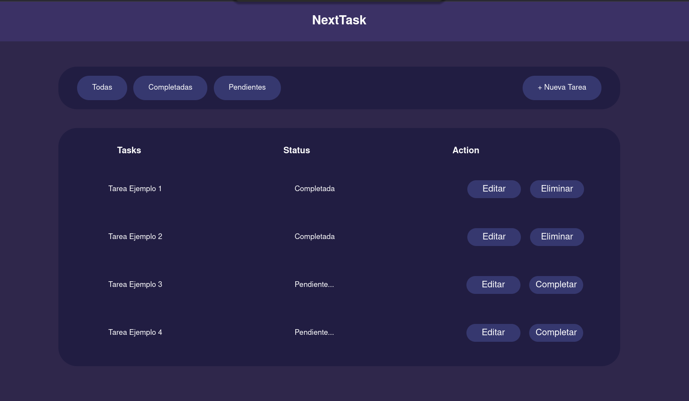
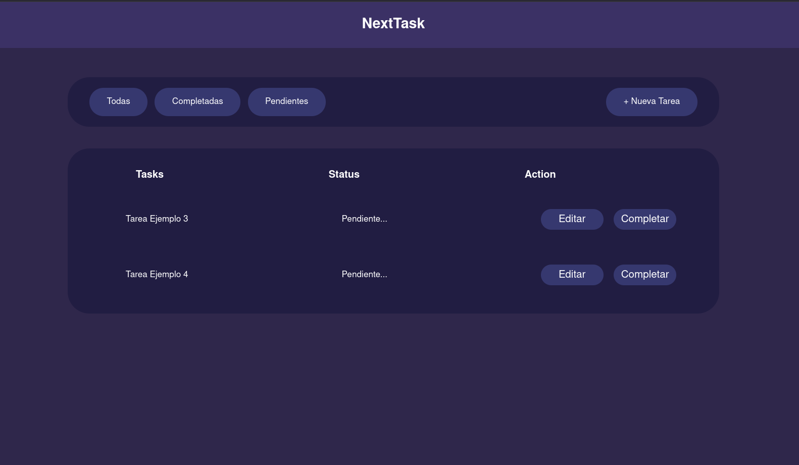
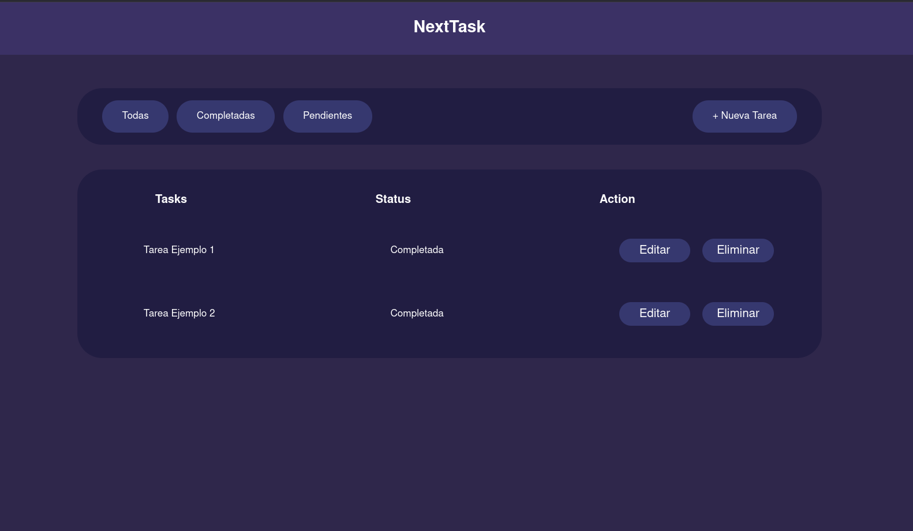
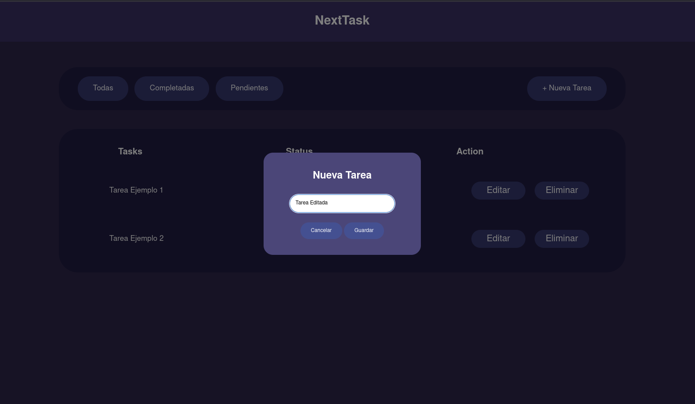
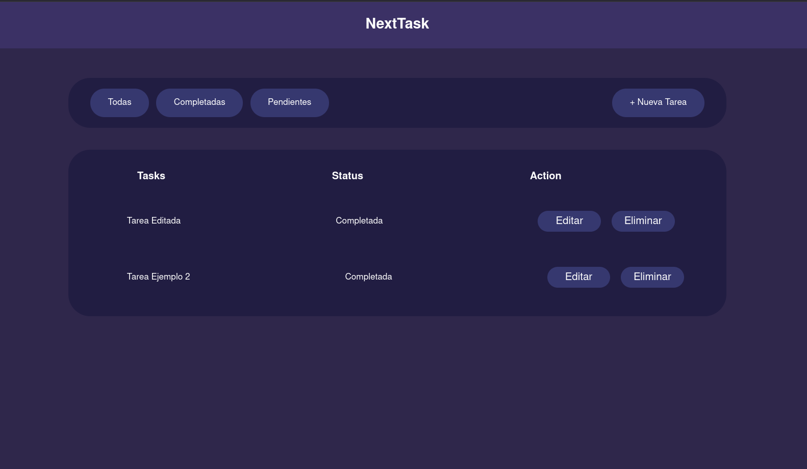

# GESTOR DE TAREAS
__NextTask__ es una aplicación web intuitiva diseñada para gestionar pendientes diarios, creada como proyecto práctico para dominar las bases de JavaScript.

## Objetivo
El objetivo principal de este proyecto es implementar la lógica de un CRUD y el manejo dinámico del DOM para ofrecer una experiencia de usuario fluida.

## Tecnologías utilizadas:
- __HTML__: Estructura del sitio web.
- __CSS__: Diseño y Layout Responsivo. (Desktop, Tablet y Mobile)
- __JavaScript__: Lógica de filtrado, estados y manejo de listas.

## Funcionamiento:
La aplicación permite un control total sobre tus tareas:
- __Gestión__: Puedes crear nuevas tareas, editar el texto de las existentes o eliminarlas.
- __Estados__: Cada tarea cuenta con un sistema de estatus dinámico.
- __Filtros__: Panel de navegación para visualizar tareas por categorías:

## Imagenes:

 

 

 

 

 

 

 

 

 

 

